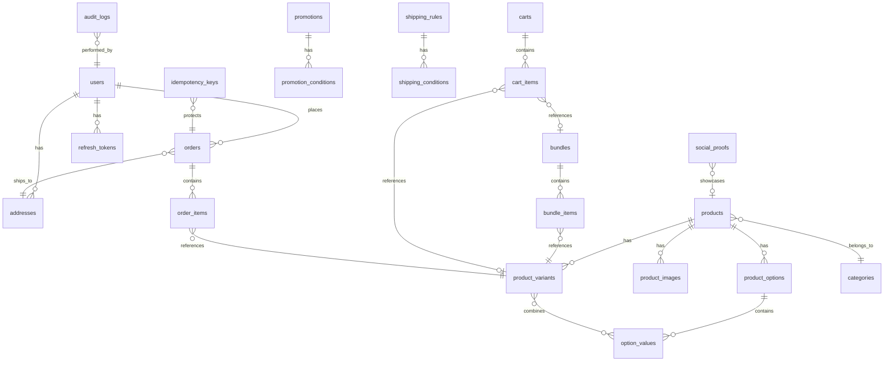

# Design Document: Generic E-Commerce Backend API

## Overview

This document outlines the technical design for a generic, reusable e-commerce backend API built with Node.js, Express, and SQLite. The system is designed to be product-agnostic, supporting any type of merchandise through a flexible options/variants system.

### Key Design Principles

- **Generic by Design**: No hardcoded product attributes (Color/Size) - all options are dynamic
- **Security First**: Rate limiting, audit logs, RBAC, and idempotency built-in
- **Operational Excellence**: Feature flags, soft delete, and comprehensive error handling
- **Performance Optimized**: Caching, indexed queries, and efficient data structures

---

## Architecture

### High-Level Architecture

```
┌─────────────────────────────────────────────────────────────────┐
│                        Client Applications                       │
│                  (Web, Mobile, Admin Dashboard)                  │
└─────────────────────────────────────────────────────────────────┘
                                  │
                                  ▼
┌─────────────────────────────────────────────────────────────────┐
│                         API Gateway Layer                        │
│  ┌─────────────┐ ┌─────────────┐ ┌─────────────┐ ┌───────────┐ │
│  │ Rate Limiter│ │    CORS     │ │  JSON Body  │ │   Auth    │ │
│  │  Middleware │ │  Middleware │ │   Parser    │ │ Middleware│ │
│  └─────────────┘ └─────────────┘ └─────────────┘ └───────────┘ │
└─────────────────────────────────────────────────────────────────┘
                                  │
                                  ▼
┌─────────────────────────────────────────────────────────────────┐
│                        Express Router Layer                      │
│  ┌──────────┐ ┌──────────┐ ┌──────────┐ ┌──────────┐           │
│  │   Auth   │ │ Products │ │  Orders  │ │   Cart   │  ...      │
│  │  Routes  │ │  Routes  │ │  Routes  │ │  Routes  │           │
│  └──────────┘ └──────────┘ └──────────┘ └──────────┘           │
└─────────────────────────────────────────────────────────────────┘
                                  │
                                  ▼
┌─────────────────────────────────────────────────────────────────┐
│                        Service Layer                             │
│  ┌──────────────┐ ┌──────────────┐ ┌──────────────┐            │
│  │ Auth Service │ │Product Service│ │ Order Service│  ...      │
│  └──────────────┘ └──────────────┘ └──────────────┘            │
│                                                                  │
│  ┌──────────────┐ ┌──────────────┐ ┌──────────────┐            │
│  │Promotion Svc │ │ Shipping Svc │ │ Analytics Svc│            │
│  └──────────────┘ └──────────────┘ └──────────────┘            │
└─────────────────────────────────────────────────────────────────┘
                                  │
                                  ▼
┌─────────────────────────────────────────────────────────────────┐
│                      Repository Layer                            │
│  ┌──────────────┐ ┌──────────────┐ ┌──────────────┐            │
│  │  User Repo   │ │ Product Repo │ │  Order Repo  │  ...       │
│  └──────────────┘ └──────────────┘ └──────────────┘            │
└─────────────────────────────────────────────────────────────────┘
                                  │
                                  ▼
┌─────────────────────────────────────────────────────────────────┐
│                        SQLite Database                           │
│                    (better-sqlite3 driver)                       │
└─────────────────────────────────────────────────────────────────┘
```

### Project Structure

```
scrubstore-api/
├── src/
│   ├── index.js                 # Application entry point
│   ├── config/
│   │   ├── database.js          # SQLite connection & setup
│   │   ├── env.js               # Environment variables
│   │   └── featureFlags.js      # Feature flag configuration
│   ├── middleware/
│   │   ├── auth.js              # JWT authentication
│   │   ├── rbac.js              # Role-based access control
│   │   ├── rateLimiter.js       # Rate limiting
│   │   ├── validator.js         # Request validation
│   │   ├── errorHandler.js      # Global error handler
│   │   ├── auditLogger.js       # Audit logging middleware
│   │   ├── featureFlag.js       # Feature flag checker
│   │   └── idempotency.js       # Idempotency handler
│   ├── routes/
│   │   ├── auth.routes.js
│   │   ├── product.routes.js
│   │   ├── category.routes.js
│   │   ├── cart.routes.js
│   │   ├── order.routes.js
│   │   ├── shipping.routes.js
│   │   ├── promotion.routes.js
│   │   ├── bundle.routes.js
│   │   ├── address.routes.js
│   │   ├── socialProof.routes.js
│   │   ├── testimonial.routes.js
│   │   ├── analytics.routes.js
│   │   ├── auditLog.routes.js
│   │   └── featureFlag.routes.js
│   ├── services/
│   │   ├── auth.service.js
│   │   ├── product.service.js
│   │   ├── category.service.js
│   │   ├── cart.service.js
│   │   ├── order.service.js
│   │   ├── shipping.service.js
│   │   ├── promotion.service.js
│   │   ├── bundle.service.js
│   │   ├── address.service.js
│   │   ├── socialProof.service.js
│   │   ├── testimonial.service.js
│   │   └── analytics.service.js
│   ├── repositories/
│   │   ├── base.repository.js   # Base with soft delete
│   │   ├── user.repository.js
│   │   ├── product.repository.js
│   │   ├── category.repository.js
│   │   ├── cart.repository.js
│   │   ├── order.repository.js
│   │   └── ... (other repos)
│   ├── models/
│   │   └── schemas.js           # Validation schemas (Joi)
│   └── utils/
│       ├── response.js          # Unified response helper
│       ├── errors.js            # Custom error classes
│       ├── orderNumber.js       # Order number generator
│       └── cache.js             # In-memory cache utility
├── uploads/                     # Product images storage
├── database/
│   └── ecommerce.db            # SQLite database file
├── .env.example
├── .env
└── package.json
```

---

## Components and Interfaces

### 1. Middleware Components

#### Rate Limiter Middleware
```javascript
// Uses sliding window algorithm
// Config: RATE_LIMIT_WINDOW_MS, RATE_LIMIT_MAX_REQUESTS
// Auth endpoints: 10 req/min
// General endpoints: 100 req/min
// Returns 429 with Retry-After header when exceeded
```

#### Authentication Middleware
```javascript
// Validates JWT from Authorization: Bearer <token>
// Attaches user object to req.user
// Returns 401 for invalid/expired tokens
```

#### RBAC Middleware
```javascript
// Checks req.user.role against required roles
// Returns 403 for unauthorized access
// Usage: rbac(['Admin']) or rbac(['Admin', 'User'])
```

#### Audit Logger Middleware
```javascript
// Intercepts POST, PUT, DELETE requests
// Captures before/after state for updates
// Logs to audit_logs table
// Fields: userId, action, entityType, entityId, previousValue, newValue, ip, userAgent, timestamp
```

#### Feature Flag Middleware
```javascript
// Checks if feature is enabled before proceeding
// Returns 503 if feature is disabled
// Uses in-memory cache with TTL
// Usage: featureFlag('promotions')
```

#### Idempotency Middleware
```javascript
// Required for POST /api/Orders
// Checks Idempotency-Key header
// Returns cached response if key exists
// Stores response for 24 hours
```

### 2. Service Layer Interfaces

#### AuthService
```javascript
interface AuthService {
  register(email, username, password): Promise<User>
  login(email, password): Promise<{accessToken, refreshToken}>
  changePassword(userId, currentPassword, newPassword): Promise<void>
  refreshToken(refreshToken): Promise<{accessToken}>
  validatePassword(password): boolean  // min 8 chars, 1 uppercase
}
```

#### ProductService
```javascript
interface ProductService {
  getAll(page, pageSize, includeDeleted?): Promise<PaginatedResult<Product>>
  getById(id): Promise<Product>
  create(data): Promise<Product>
  update(id, data): Promise<Product>
  delete(id, userId): Promise<void>  // Soft delete
  search(keyword, page, pageSize): Promise<PaginatedResult<Product>>
  filter(criteria): Promise<PaginatedResult<Product>>
  
  // Options & Variants
  createOptionGroup(productId, name, values): Promise<OptionGroup>
  getVariants(productId): Promise<Variant[]>
  updateVariantStock(variantId, quantity): Promise<void>
  updateVariantPrice(variantId, price): Promise<void>
}
```

#### CartService
```javascript
interface CartService {
  addItem(sessionId, productId, variantId, quantity): Promise<CartItem>
  addBundle(sessionId, bundleId, quantity): Promise<CartItem>
  getCart(sessionId): Promise<Cart>  // Includes promotions breakdown
  updateQuantity(sessionId, itemId, quantity): Promise<void>
  removeItem(sessionId, itemId): Promise<void>
  clearCart(sessionId): Promise<void>
  getItemCount(sessionId): Promise<number>
  getTotalPrice(sessionId): Promise<PriceBreakdown>
}
```

#### OrderService
```javascript
interface OrderService {
  create(sessionId, customerDetails, addressId, idempotencyKey): Promise<Order>
  getAll(page, pageSize, filters?): Promise<PaginatedResult<Order>>
  getById(id): Promise<Order>
  getBySession(sessionId): Promise<Order[]>
  updateStatus(id, status, userId): Promise<Order>
  filterByStatus(status): Promise<Order[]>
  filterByDateRange(from, to): Promise<Order[]>
}
```

#### PromotionService
```javascript
interface PromotionService {
  getApplicablePromotions(cart): Promise<Promotion[]>
  applyPromotions(cart): Promise<PromotionResult>
  create(data): Promise<Promotion>
  update(id, data): Promise<Promotion>
  delete(id): Promise<void>
}
```

#### ShippingService
```javascript
interface ShippingService {
  calculateShipping(sessionId): Promise<ShippingResult>
  getRules(): Promise<ShippingRule[]>
  createRule(data): Promise<ShippingRule>
  updateRule(id, data): Promise<ShippingRule>
  deleteRule(id): Promise<void>
}
```

---

## Data Models

### Entity Relationship Diagram



### Core Tables Schema

#### users
```sql
CREATE TABLE users (
  id TEXT PRIMARY KEY DEFAULT (lower(hex(randomblob(16)))),
  email TEXT UNIQUE NOT NULL,
  username TEXT UNIQUE NOT NULL,
  password_hash TEXT NOT NULL,
  role TEXT DEFAULT 'User' CHECK(role IN ('Admin', 'User')),
  created_at DATETIME DEFAULT CURRENT_TIMESTAMP,
  updated_at DATETIME DEFAULT CURRENT_TIMESTAMP,
  deleted_at DATETIME,
  deleted_by TEXT REFERENCES users(id)
);
```

#### products
```sql
CREATE TABLE products (
  id TEXT PRIMARY KEY DEFAULT (lower(hex(randomblob(16)))),
  name_en TEXT NOT NULL,
  name_ar TEXT NOT NULL,
  description_en TEXT,
  description_ar TEXT,
  base_price DECIMAL(10,2) NOT NULL,
  category_id TEXT REFERENCES categories(id),
  created_at DATETIME DEFAULT CURRENT_TIMESTAMP,
  updated_at DATETIME DEFAULT CURRENT_TIMESTAMP,
  deleted_at DATETIME,
  deleted_by TEXT REFERENCES users(id)
);
CREATE INDEX idx_products_category ON products(category_id);
CREATE INDEX idx_products_deleted ON products(deleted_at);
```

#### product_options (Generic Options System)
```sql
CREATE TABLE product_options (
  id TEXT PRIMARY KEY DEFAULT (lower(hex(randomblob(16)))),
  product_id TEXT NOT NULL REFERENCES products(id),
  name_en TEXT NOT NULL,  -- e.g., "Size", "Color", "Material", "Storage"
  name_ar TEXT NOT NULL,
  display_order INTEGER DEFAULT 0,
  created_at DATETIME DEFAULT CURRENT_TIMESTAMP
);
CREATE INDEX idx_product_options_product ON product_options(product_id);
```

#### option_values
```sql
CREATE TABLE option_values (
  id TEXT PRIMARY KEY DEFAULT (lower(hex(randomblob(16)))),
  option_id TEXT NOT NULL REFERENCES product_options(id),
  value_en TEXT NOT NULL,  -- e.g., "Large", "Red", "Cotton", "256GB"
  value_ar TEXT NOT NULL,
  extra_data TEXT,  -- JSON for color hex, etc.
  display_order INTEGER DEFAULT 0,
  created_at DATETIME DEFAULT CURRENT_TIMESTAMP
);
CREATE INDEX idx_option_values_option ON option_values(option_id);
```

#### product_variants
```sql
CREATE TABLE product_variants (
  id TEXT PRIMARY KEY DEFAULT (lower(hex(randomblob(16)))),
  product_id TEXT NOT NULL REFERENCES products(id),
  sku TEXT UNIQUE,
  price_override DECIMAL(10,2),  -- NULL means use base_price
  quantity INTEGER DEFAULT 0,
  created_at DATETIME DEFAULT CURRENT_TIMESTAMP,
  updated_at DATETIME DEFAULT CURRENT_TIMESTAMP,
  deleted_at DATETIME,
  deleted_by TEXT REFERENCES users(id)
);
CREATE INDEX idx_variants_product ON product_variants(product_id);
CREATE INDEX idx_variants_sku ON product_variants(sku);
```

#### variant_option_values (Junction Table)
```sql
CREATE TABLE variant_option_values (
  variant_id TEXT NOT NULL REFERENCES product_variants(id),
  option_value_id TEXT NOT NULL REFERENCES option_values(id),
  PRIMARY KEY (variant_id, option_value_id)
);
```

#### orders
```sql
CREATE TABLE orders (
  id TEXT PRIMARY KEY DEFAULT (lower(hex(randomblob(16)))),
  order_number TEXT UNIQUE NOT NULL,  -- Human-readable: ORD-20240115-XXXX
  user_id TEXT REFERENCES users(id),
  session_id TEXT,
  status TEXT DEFAULT 'Pending' CHECK(status IN ('Pending', 'Confirmed', 'Packed', 'Shipped', 'Delivered', 'Cancelled', 'Returned')),
  subtotal DECIMAL(10,2) NOT NULL,
  discount_amount DECIMAL(10,2) DEFAULT 0,
  shipping_cost DECIMAL(10,2) DEFAULT 0,
  total DECIMAL(10,2) NOT NULL,
  
  -- Address snapshot
  shipping_full_name TEXT NOT NULL,
  shipping_phone TEXT NOT NULL,
  shipping_country TEXT NOT NULL,
  shipping_city TEXT NOT NULL,
  shipping_area TEXT NOT NULL,
  shipping_details TEXT,
  
  -- Promotions applied (JSON)
  applied_promotions TEXT,
  
  created_at DATETIME DEFAULT CURRENT_TIMESTAMP,
  updated_at DATETIME DEFAULT CURRENT_TIMESTAMP,
  deleted_at DATETIME,
  deleted_by TEXT REFERENCES users(id)
);
CREATE INDEX idx_orders_user ON orders(user_id);
CREATE INDEX idx_orders_session ON orders(session_id);
CREATE INDEX idx_orders_status ON orders(status);
CREATE INDEX idx_orders_created ON orders(created_at);
```

#### promotions
```sql
CREATE TABLE promotions (
  id TEXT PRIMARY KEY DEFAULT (lower(hex(randomblob(16)))),
  name_en TEXT NOT NULL,
  name_ar TEXT NOT NULL,
  type TEXT NOT NULL CHECK(type IN ('quantity_based', 'first_order', 'category_based', 'min_order_amount')),
  discount_type TEXT NOT NULL CHECK(discount_type IN ('percentage', 'fixed')),
  discount_value DECIMAL(10,2) NOT NULL,
  priority INTEGER DEFAULT 0,  -- Higher = applied first
  start_date DATETIME,
  end_date DATETIME,
  is_active INTEGER DEFAULT 1,
  conditions TEXT,  -- JSON: {minQuantity, categoryId, minAmount}
  created_at DATETIME DEFAULT CURRENT_TIMESTAMP,
  deleted_at DATETIME,
  deleted_by TEXT REFERENCES users(id)
);
CREATE INDEX idx_promotions_active ON promotions(is_active, start_date, end_date);
```

#### bundles
```sql
CREATE TABLE bundles (
  id TEXT PRIMARY KEY DEFAULT (lower(hex(randomblob(16)))),
  name_en TEXT NOT NULL,
  name_ar TEXT NOT NULL,
  description_en TEXT,
  description_ar TEXT,
  pricing_type TEXT NOT NULL CHECK(pricing_type IN ('fixed', 'discount_percentage')),
  price_value DECIMAL(10,2) NOT NULL,  -- Fixed price or discount %
  is_active INTEGER DEFAULT 1,
  created_at DATETIME DEFAULT CURRENT_TIMESTAMP,
  deleted_at DATETIME,
  deleted_by TEXT REFERENCES users(id)
);

CREATE TABLE bundle_items (
  id TEXT PRIMARY KEY DEFAULT (lower(hex(randomblob(16)))),
  bundle_id TEXT NOT NULL REFERENCES bundles(id),
  variant_id TEXT NOT NULL REFERENCES product_variants(id),
  quantity INTEGER DEFAULT 1
);
```

#### audit_logs
```sql
CREATE TABLE audit_logs (
  id TEXT PRIMARY KEY DEFAULT (lower(hex(randomblob(16)))),
  user_id TEXT REFERENCES users(id),
  action TEXT NOT NULL CHECK(action IN ('CREATE', 'UPDATE', 'DELETE', 'RESTORE')),
  entity_type TEXT NOT NULL,
  entity_id TEXT NOT NULL,
  previous_value TEXT,  -- JSON
  new_value TEXT,       -- JSON
  ip_address TEXT,
  user_agent TEXT,
  created_at DATETIME DEFAULT CURRENT_TIMESTAMP
);
CREATE INDEX idx_audit_user ON audit_logs(user_id);
CREATE INDEX idx_audit_entity ON audit_logs(entity_type, entity_id);
CREATE INDEX idx_audit_created ON audit_logs(created_at);
```

#### feature_flags
```sql
CREATE TABLE feature_flags (
  name TEXT PRIMARY KEY,
  description TEXT,
  is_enabled INTEGER DEFAULT 1,
  updated_at DATETIME DEFAULT CURRENT_TIMESTAMP,
  updated_by TEXT REFERENCES users(id)
);

-- Default flags
INSERT INTO feature_flags (name, description) VALUES
  ('promotions', 'Automatic promotion system'),
  ('bundles', 'Product bundles feature'),
  ('social_proof', 'Social proof videos'),
  ('testimonials', 'Marketing testimonials'),
  ('analytics', 'Product analytics tracking');
```

#### idempotency_keys
```sql
CREATE TABLE idempotency_keys (
  key TEXT PRIMARY KEY,
  response TEXT NOT NULL,  -- JSON cached response
  created_at DATETIME DEFAULT CURRENT_TIMESTAMP,
  expires_at DATETIME NOT NULL
);
CREATE INDEX idx_idempotency_expires ON idempotency_keys(expires_at);
```

---

## Error Handling

### Error Response Format
```javascript
{
  "success": false,
  "message": "Human-readable error message",
  "errorCode": "MODULE_ERROR_CODE",
  "details": {}  // Optional: field-level errors for validation
}
```

### Error Codes by Module
| Module | Code | HTTP Status | Description |
|--------|------|-------------|-------------|
| AUTH | AUTH_INVALID_CREDENTIALS | 401 | Invalid email/password |
| AUTH | AUTH_TOKEN_EXPIRED | 401 | JWT token expired |
| AUTH | AUTH_FORBIDDEN | 403 | Insufficient permissions |
| AUTH | AUTH_WEAK_PASSWORD | 400 | Password doesn't meet requirements |
| PRODUCT | PRODUCT_NOT_FOUND | 404 | Product doesn't exist |
| PRODUCT | PRODUCT_DELETED | 410 | Product was soft-deleted |
| CART | CART_EMPTY | 400 | Cannot checkout empty cart |
| CART | CART_INSUFFICIENT_STOCK | 400 | Not enough inventory |
| ORDER | ORDER_INVALID_STATUS | 400 | Invalid status transition |
| ORDER | ORDER_IDEMPOTENCY_MISSING | 400 | Missing Idempotency-Key |
| RATE | RATE_LIMIT_EXCEEDED | 429 | Too many requests |
| FEATURE | FEATURE_DISABLED | 503 | Feature is turned off |
| VALIDATION | VALIDATION_FAILED | 400 | Request validation failed |

### Order Status Transitions
```
Pending → Confirmed → Packed → Shipped → Delivered
    ↓         ↓         ↓         ↓
Cancelled  Cancelled  Cancelled  Returned
```

---

## Testing Strategy

### Unit Tests
- Service layer business logic
- Validation functions
- Utility functions (order number generation, cache)
- Promotion calculation logic

### Integration Tests
- Repository operations with SQLite
- Middleware chain (auth → rbac → feature flag)
- Cart → Order flow with inventory deduction
- Idempotency key handling

### API Tests
- All endpoint happy paths
- Error scenarios (401, 403, 404, 429)
- Pagination and filtering
- Soft delete and restore

### Test Data
- Seed script for development database
- Factory functions for test entities
- Isolated test database per test run

---

## Security Considerations

1. **Password Storage**: bcrypt with cost factor 12
2. **JWT**: RS256 algorithm, 15-minute access token, 7-day refresh token
3. **Rate Limiting**: Sliding window per IP, stricter on auth endpoints
4. **Input Validation**: Joi schemas on all inputs
5. **SQL Injection**: Parameterized queries via better-sqlite3
6. **Audit Trail**: Immutable logs for compliance
7. **Soft Delete**: Data recovery capability, no permanent loss

---

## Performance Optimizations

1. **Database Indexes**: On foreign keys, frequently filtered columns
2. **Feature Flag Cache**: In-memory with 5-minute TTL
3. **Pagination**: Cursor-based for large datasets
4. **Lazy Loading**: Variants loaded only when requested
5. **Connection Pooling**: better-sqlite3 handles efficiently
6. **Idempotency Cleanup**: Scheduled job every hour
